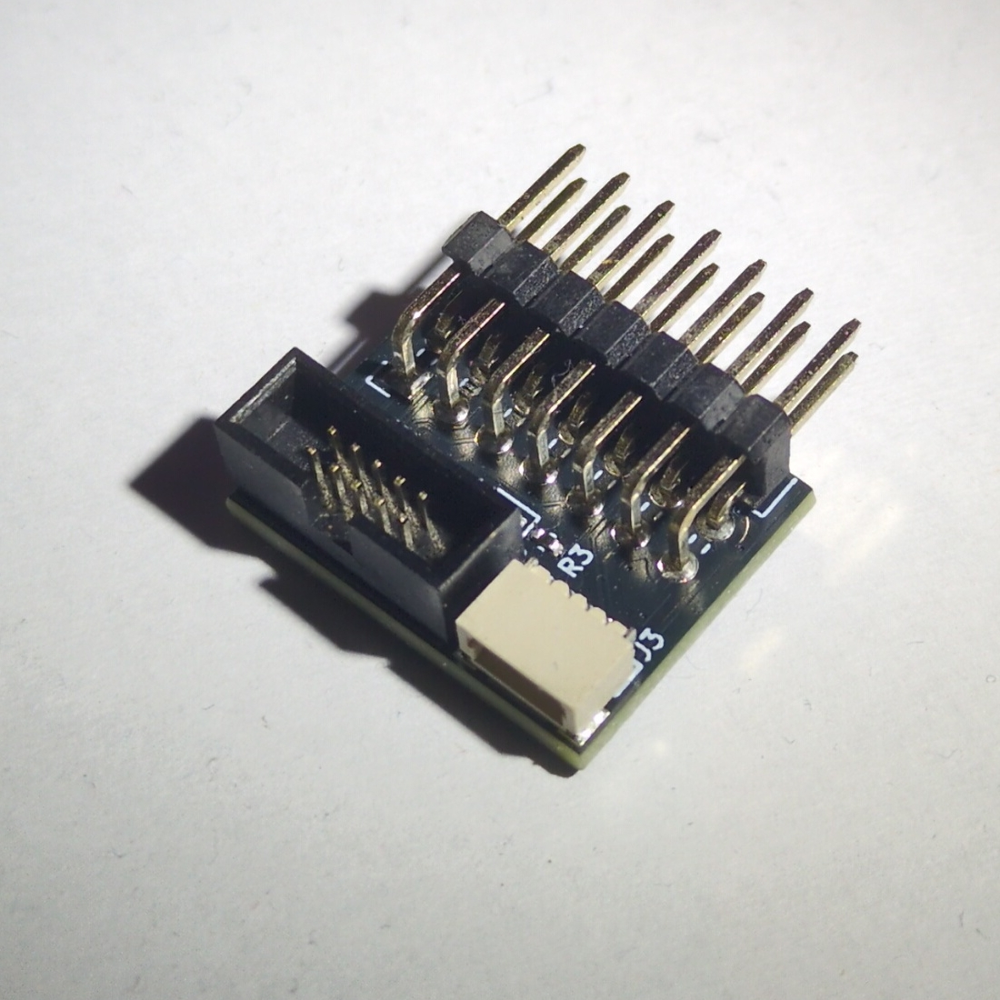
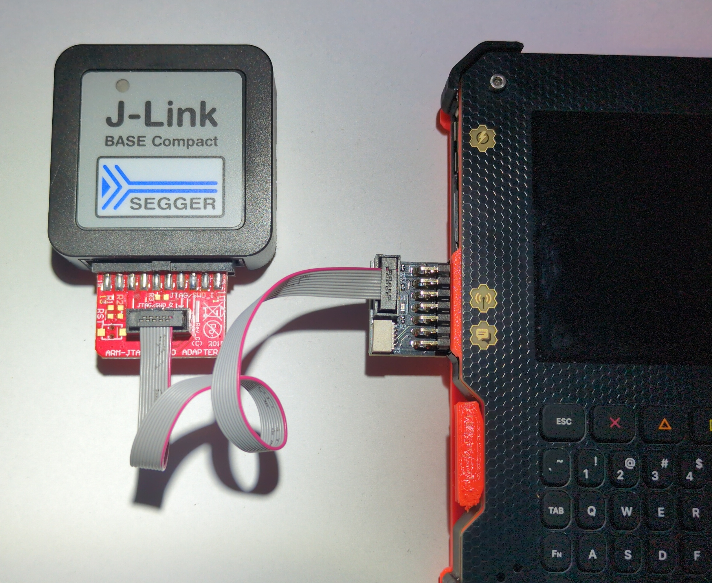

# JTAG and QWIIC add-on board

This add-on board plugs into the CATT connector on the side of your Tanmatsu and provides a standard 10-pin JTAG interface for debugging the ESP32-P4 application processor as well as a QWIIC connector for connecting I2C devices and a LED for quick visual feedback.

## Connectors

This section describes how the pins of the connectors on the board are connected to each other.

| Pin      | CATT pin | CATT name  | JTAG        | QWIIC       | LED | Description                                               |
|----------|----------|------------|-------------|-------------|-----|-----------------------------------------------------------|
| 1        | 14       | +3.3v      | VTref       | 3.3v output | -   | 3.3v output from Tanmatsu, used as reference voltage      |
| 2        | 13       | P4 reset   | RESET       | -           | -   | Reset input for the ESP32-P4                              |
| 3        | 12       | GND        | GND         | GND         | -   | Ground                                                    |
| 4        | 11       | GND        | GND         | GND         | -   | Ground                                                    |
| 5        | 10       | USER F     | MTDI        | -           | -   | JTAG data input                                           |
| 6        | 9        | USER E     | MTCK        | -           | -   | JTAG clock                                                |
| 7        | 8        | USER D     | MTDO        | -           | -   | JTAG data output                                          |
| 8        | 7        | USER C     | MTMS        | -           | -   | JTAG test mode select                                     |
| 9        | 6        | USER B     | DETECT      | -           | -   | Connected to ground by the programmer to enable JTAG mode |
| 10       | 5        | USER A     | -           | -           | LED | LED control, active low                                   |
| 11       | 4        | I2C SCL    | -           | SCL         | -   | I2C clock output                                          |
| 12       | 3        | I2C SDA    | -           | SDA         | -   | I2C data I/O                                              |
| 13       | 2        | GND        | GND         | GND         | -   | Ground                                                    |
| 14       | 1        | +3.3v      | VTref       | +3.3v       | -   | 3.3v output from Tanmatsu, used as reference voltage      |

The JTAG header uses the standard 10-pin 1.27mm pitch "Cortex debug" style pinout.

| Pin      | Description |
|----------|-------------|
| 1        | VTref       |
| 2        | MTMS        |
| 3        | GND         |
| 4        | MTCK        |
| 5        | GND         |
| 6        | MTDO        |
| 7        | -           |
| 8        | MTDI        |
| 9        | GND detect  |
| 10       | RESET       |
  
## Links

 - [Schematic](schematic.pdf)
 - [Repository](https://github.com/Nicolai-Electronics/tanmatsu-addon-catt-jtag)