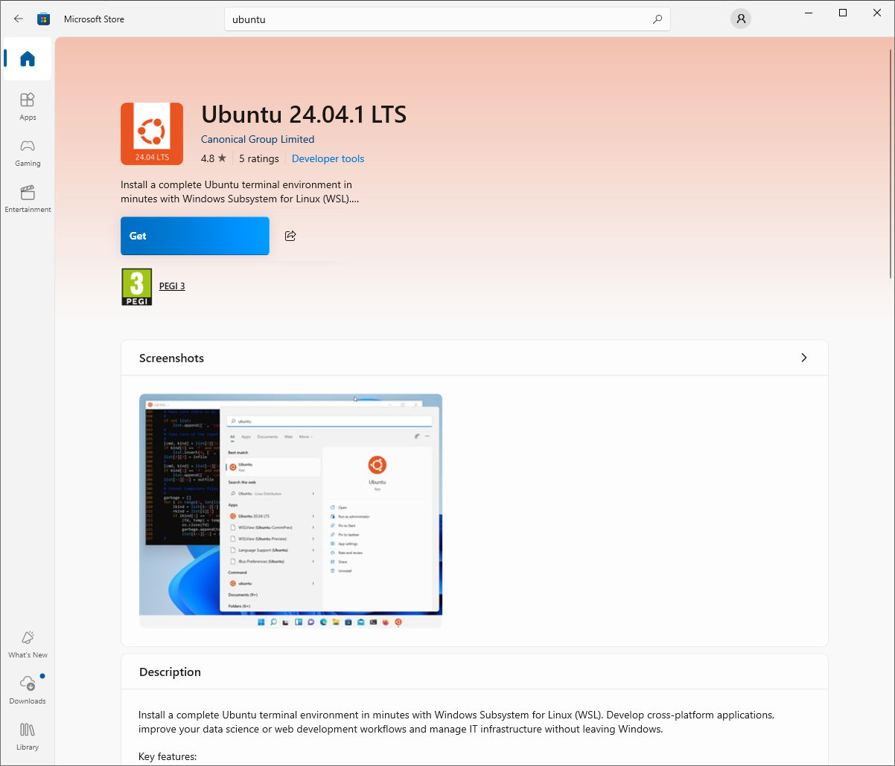
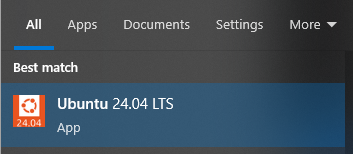
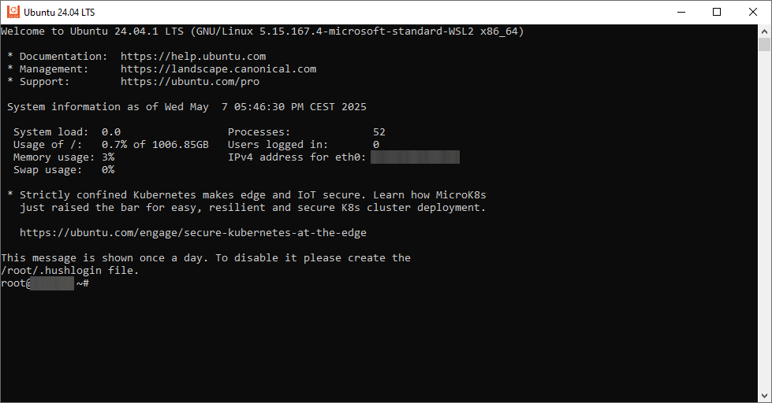
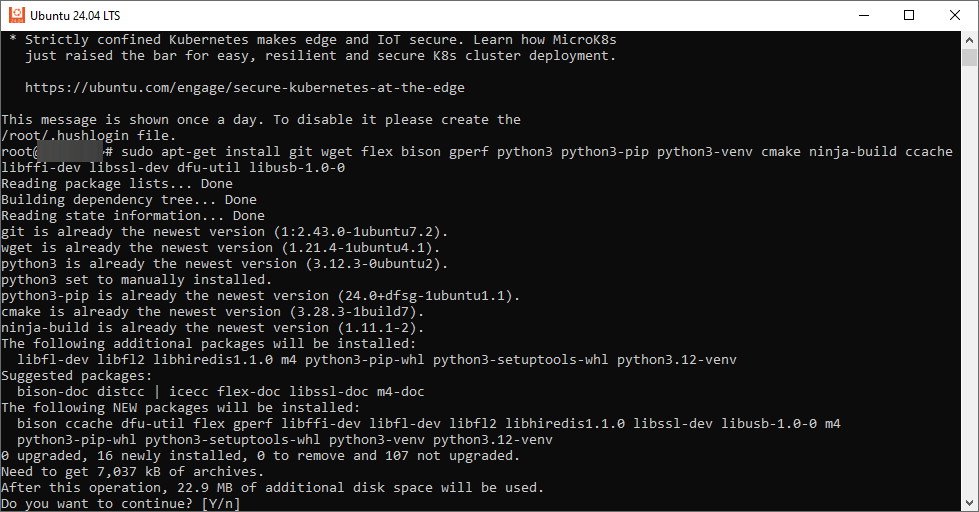
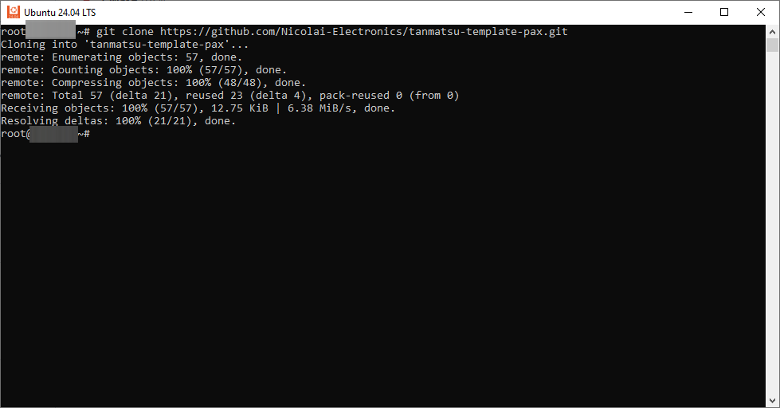
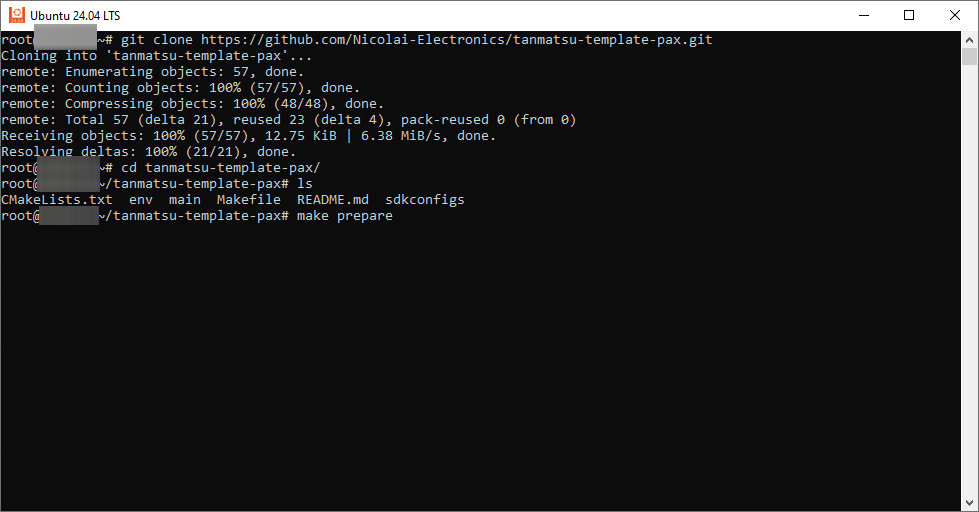
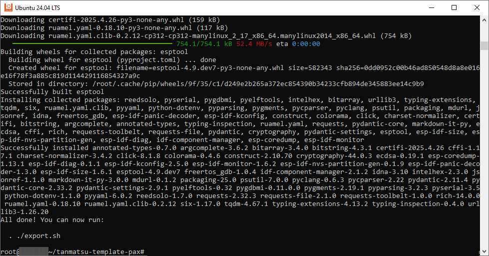

# Compiling the template app

## Setting up the environment on Windows

On Windows we recommend using WSL (Windows Subsystem for Linux) to create a virtual Linux environment to work in.

### Step 1: download `Ubuntu 24.04.1 LTS` from the Microsoft store.



Click the `Get` button. After the Linux environment is installed you can find it in the start menu.



After starting the Ubuntu environment you should be presented by the following prompt:



### Step 2: install required packages

Run the following command to install the dependencies:

```
sudo apt-get install git wget flex bison gperf python3 python3-pip python3-venv cmake ninja-build ccache libffi-dev libssl-dev dfu-util libusb-1.0-0
```

Press `Y` when asked if you want to continue.



### Step 3: clone the repository

Either clone the template repository or first use the template on Github to set up your own Git repository to work with.

Then clone your repository into the Ubuntu environment:

```
git clone https://github.com/Nicolai-Electronics/tanmatsu-template-pax
```

Replace the URL in the command above with the URL of your repository.



### Step 4: install the ESP-IDF SDK

First enter the folder into which you have cloned the repository.

```
cd tanmatsu-template-pax
```

Then run the following command to install ESP-IDF and the toolchain into subfolders of the working folder. The sdk and toolchain folders have been added to the `.gitignore` file so that they won't be committed into the repository when you commit your work.

```
make prepare
```






#### Step 5: compile the app

Run the following command to compile the app:

```
make build
```

Optionally you can add a `DEVICE=` argument to select another target device. The default device is Tanmatsu. Currently only Tanmatsu and the MCH2022 badge by Badge.Team are supported.

```
make build DEVICE=mch2022
```

Build output can be found in the `build/tanmatsu` or `build/mch2022` folders depending on the selected target.

The binary which can be installed on the target device can be found at `build/tanmatsu/application.bin`. This is the only file you need to run your app.

You can choose to install your app as the main firmware for the target device, however do note that this will overwrite the launcher and all other already installed data on your device.

~~Instead of directly flashing the application we recommend using BadgeLink either via a compatible browser or using the commandline utilities to install your application via the USB port.~~

**The BadgeLink tools are not yet available but will be released soon. This page will be updated when the tools have been made available.**
