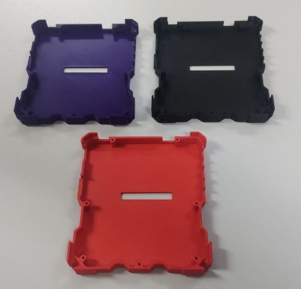
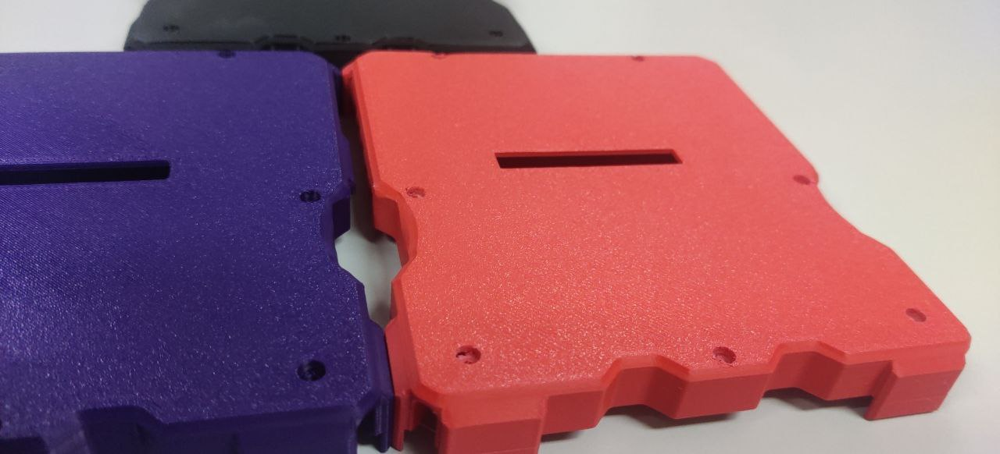
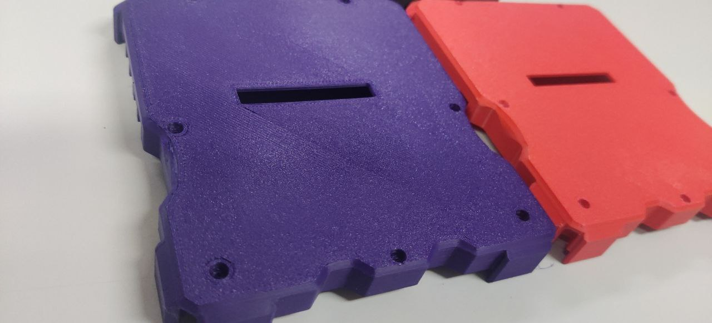
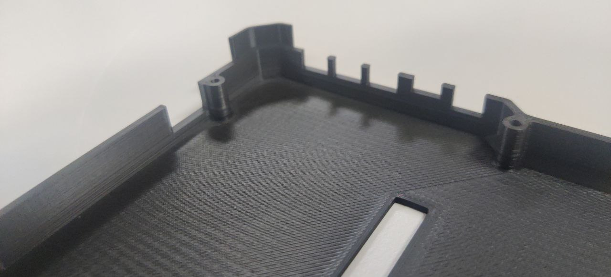
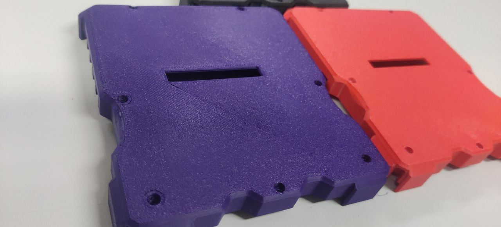
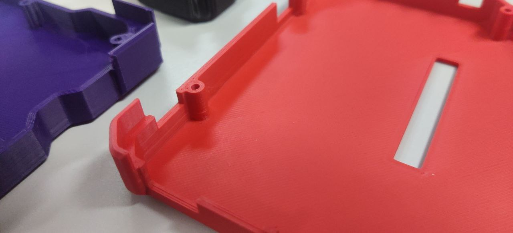
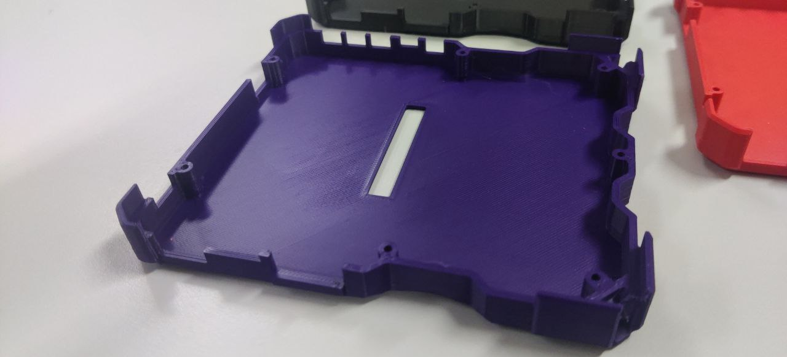

# 3D printed case

Information about the 3D printed case for Tanmatsu.

_Note: information on this page is actively being worked on and might contain accidental errors and inaccuracies._

## Filament

The 3D printed case and spacer are printed using Extrudr PLA NX2 on Prusa Mini and Prusa XL printers.

## Design files

Once Tanmatsu is available the spacer and case designs will be published as STEP and STL files.

The 3D printed case and spacer will both be available as a spare part from our webshop once Tanmatsu is shipped.

## Photos

These photos show some of the prototype 3D printed cases, final design will differ slightly because we are still actively working on improving the design for easier manufacturing and better dust protection.

## Special thanks

We want to thank our friends over at [YTec 3D](https://ytec3d.com/) for developing the Tanmatsu case and designs. Check out their amazing projects.

## Questions?

If you have questions please contact us by joining one of our community chatgroups ([Telegram](https://t.me/+SueEz5IWYR05NzU8) and [Discord](https://discord.gg/KkY6JqNCqT)) or by [emailing](mailto:contact@nicolaielectronics.nl) us.

