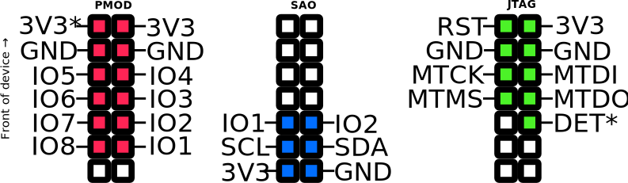

# External add-on port

The external expansion port (CATT, for "Connect All The Things") on Tanmatsu has been designed to be compatible with both PMOD and SAO add-on boards, in addition to it being a port that exposes 8 GPIOs and 3.3v power it can also be used as JTAG interface for the ESP32-P4.

## Pinout

| Pin | Function     | CATT name  |  PMOD name | SAO name | JTAG name | GPIO | Description                                               | Notes                                                                                                                                                                        |
|-----|--------------|------------|------------|----------|-----------|------|-----------------------------------------------------------|------------------------------------------------------------------------------------------------------------------------------------------------------------------------------|
| 1   | Power out    | +3.3v      | -          | +3.3v    | +3.3v     | -    | 3.3v output                                               |                                                                                                                                                                              |
| 2   | Power out    | GND        | -          | GND      | GND       | -    | Ground                                                    |                                                                                                                                                                              |
| 3   | GPIO         | I2C SDA    | IO8        | SDA      | -         | 12   | GPIO or I2C data                                          | Used as I2C bus for automatic add-on detection                                                                                                                               |
| 4   | GPIO         | I2C SCL    | IO1        | SCL      | -         | 13   | GPIO or I2C clock                                         | Used as I2C bus for automatic add-on detection                                                                                                                               |
| 5   | GPIO         | USER A     | IO7        | IO1      | -         | 15   | GPIO                                                      |                                                                                                                                                                              |
| 6   | GPIO         | USER B     | IO2        | IO2      | DETECT    | 34   | GPIO, with special function                               | Pull low on startup to switch to JTAG mode                                                                                                                                   |
| 7   | GPIO         | USER C     | IO6        | -        | MTMS      | 4    | GPIO or JTAG                                              |                                                                                                                                                                              |
| 8   | GPIO         | USER D     | IO3        | -        | MTDO      | 5    | GPIO or JTAG                                              |                                                                                                                                                                              |
| 9   | GPIO         | USER E     | IO5        | -        | MTCK      | 2    | GPIO or JTAG                                              |                                                                                                                                                                              |
| 10  | GPIO         | USER F     | IO4        | -        | MTDI      | 3    | GPIO or JTAG                                              |                                                                                                                                                                              |
| 11  | Power out    | GND        | GND        | -        | GND       | -    | Ground                                                    |                                                                                                                                                                              |
| 12  | Power out    | GND        | GND        | -        | GND       | -    | Ground                                                    |                                                                                                                                                                              |
| 13  | System reset | P4 reset   | "3.3v"     | -        | P4 reset  | -    | Reset input for the ESP32-P4                              | Can be converted to +3.3v output by shorting JP1 on the mainboard                                                                                                            |
| 14  | Power out    | +3.3v      |            | -        | +3.3v     | -    | 3.3v output                                               |                                                                                                                                                                              |

 

## Limitations, warnings and hints

- Total for all 3.3v outputs **must not exceed 1A** of current. It is generally adviced to stay well below this figure.
- Detect pin has a pull-up resistor connected, pull low to enable JTAG functionality for the ESP32-P4
- You can short jumper JP1 to connect pin 13 to the +3.3v rail
- Even if JTAG functioality is selected you can simply initialize a pin as GPIO to use it as such
- If you want to use JTAG via the USB-C port you will need to set the JTAG source manually in software if pin 6 (GPIO34) is being pulled low by an add-on board
