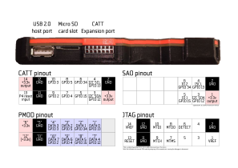

# External add-on port

```{toctree}
:hidden:

sao-adapter/index
```

The external expansion port (CATT, for "Connect All The Things") on Tanmatsu has been designed to be compatible with both PMOD and SAO add-on boards, in addition to it being a port that exposes 8 GPIOs and 3.3v power it can also be used as JTAG interface for the ESP32-P4.

## Pinout

|               | Pin 1     | Pin 2 | Pin 3   | Pin 4   | Pin 5   | Pin 6   | Pin 7   |
|---------------|-----------|-------|---------|---------|---------|---------|---------|
| CATT          | +3.3v out | GND   | I2C SDA | I2C SCL | IO 1    | IO 2    | IO 3    |
| PMOD          | -         | -     | "7": D4 | "1": D0 | "8": D5 | "2": D1 | "9": D6 |
| SAO           | +3.3v out | GND   | I2C SDA | I2C SCL | IO 1    | IO 2    | -       |
| JTAG          | +3.3v out | GND   | -       | -       | -       | DETECT  | MTMS    |
| JTAG adapter  | +3.3v out | GND   | I2C SDA | I2C SCL | LED     | DETECT  | MTMS    |
| ESP32-P4 GPIO | -         | -     | 12      | 13      | 15      | 34      | 4       |

|               | Pin 8   | Pin 9    | Pin 10  | Pin 11 | Pin 12 | Pin 13   | Pin 14    |
|---------------|---------|----------|---------|--------|--------|----------|-----------|
| CATT          | IO 4    | IO 5     | IO 6    | GND    | GND    | P4 reset | +3.3v out |
| PMOD          | "3": D5 | "10": D7 | "4": D3 | GND    | GND    | "+3.3v"  | +3.3v out |
| SAO           | -       | -        | -       | -      | -      | -        | -         |
| JTAG          | MTDO    | MTCK     | MTDI    | GND    | GND    | P4 reset | +3.3v out |
| JTAG adapter  | MTDO    | MTCK     | MTDI    | GND    | GND    | P4 reset | +3.3v out |
| ESP32-P4 GPIO | 5       | 2        | 3       | -      | -      | -        | -         |


<br />



[Download this pinout sheet as a PDF](catt.pdf)

## Limitations, warnings and hints

- Total for all 3.3v outputs **must not exceed 1A** of current. It is generally adviced to stay well below this figure.
- To switch the JTAG interface from the USB serial/debug peripheral over to the CATT port pins pull "DETECT" low. This pin has a pull-up resistor in place.
- Software can overrule the JTAG interface pins by configuring them as GPIO, this will cause the debugger to disconnect.
- If you want to use JTAG via the USB-C port you will need to set the JTAG source manually in software if pin 6 (GPIO34) is being pulled low by an add-on board
- The JTAG adapter we sell includes a LED and a QWIIC port next to the standard 10-pin JTAG connector.
- The "P4 reset" input can safely be ignored or connected to the 3.3v rail if not in use.
- You can short jumper JP1 to connect pin 13 to the +3.3v rail, disabling the reset signal on the CATT port.
- Pins 3 and 4 (I2C) will show some activity during startup of the launcher firmware, to detect add-on boards with an identification EEPROM.
