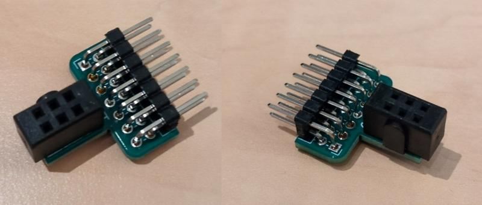
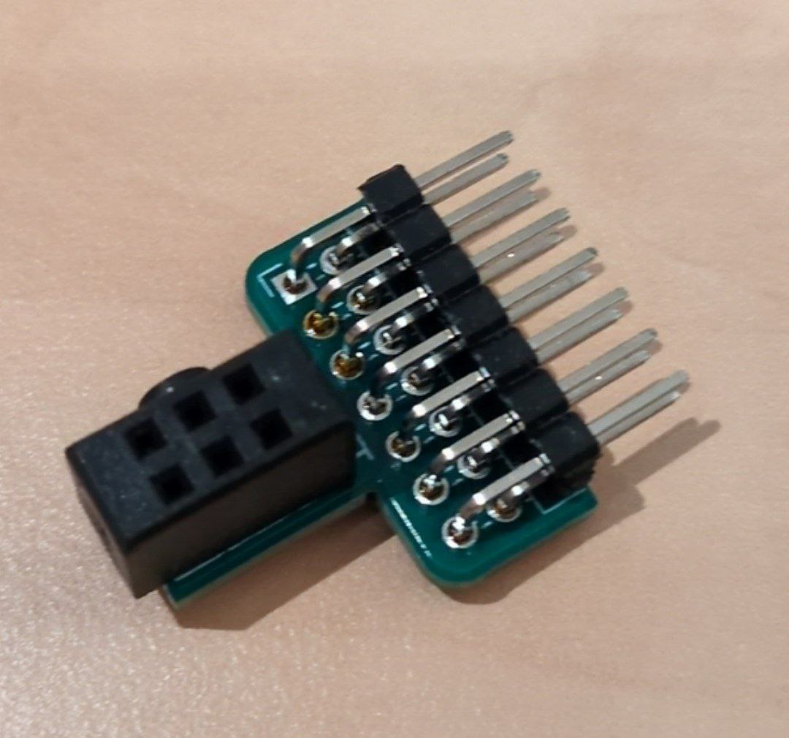
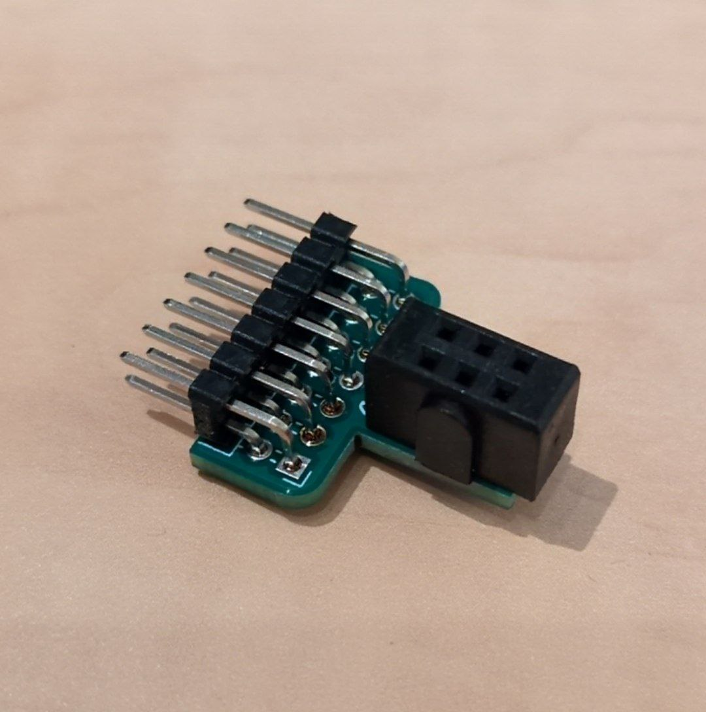

# SAO adapter

```{toctree}
:hidden:

self
```

The CATT to SAO adapter is a small adapter board that converts the external add-on port of Tanmatsu into a standard "Simple Add-On" port as found on various event badges.



## Assembling the adapter

The recommended method for assembling the adapter board is to start with the male pinheader connecting to Tanmatsu as this component is of lower height than the boxed female header for the SAO side. Make sure that the side of the board with the "CATT SAO" text is the side on which you plug in the connectors, assembling the board upside down will not work.

## Pin mapping

## Pinout

| CATT | SAO | Description |
|------|-----|-------------|
| 1    |     |             |
| 2    |     |             |
| 3    |     |             |
| 4    |     |             |
| 5    |     |             |
| 6    |     |             |
| 7    |     |             |
| 8    |     |             |
| 9    |     |             |
| 10   |     |             |
| 11   |     |             |
| 12   |     |             |
| 13   |     |             |
| 14   |     |             |

## Photos




