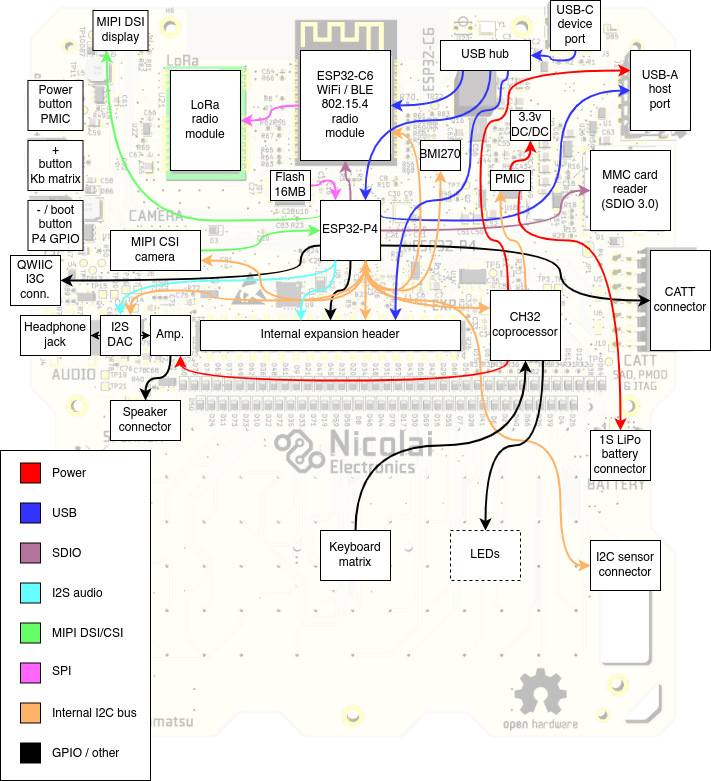
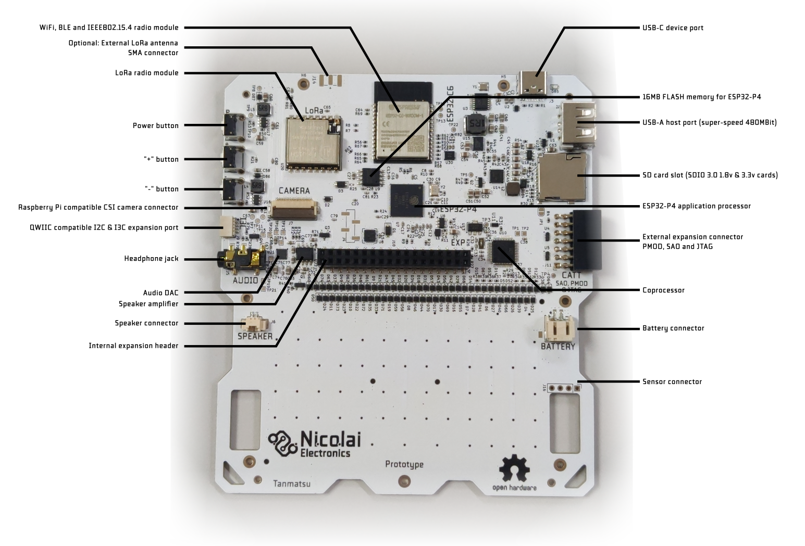

# Hardware

This page describes all the hardware on the Tanmatsu main board, explaining how everything is connected.



The ESP32-P4 application processor is the star of the show, this is the processor that will run your applications.

It is directly connected to a lot of peripherals:

 - Quad SPI interface to a 16MB flash chip for storing firmware, apps and data
 - MIPI DSI and CSI interfaces to the display and camera ports
 - Multiple USB interfaces: as device to the USB-C port via the hub and as host to the USB-A port and the internal expansion header
 - Multiple SDIO interfaces: to the MMC card reader and the ESP32-C6 radio module
 - I2C/I3C interface: to the QWIIC port
 - I2C interface: to an I2C bus connecting all the peripherals on the main board to each other

## LEDs

Tanmatu has seven LEDs, six of which are addressable RGB LEDs located on the left and right sides of the screen. The seventh LED is located on the back of the board next to the USB-C connector.

The addressable LEDs are fully user controllable by writing the relevant registers of the coprocessor via the internal I2C bus. By default the coprocessor controls the LEDs automatically, this can of course be disabled.

When in automatic control mode the LEDs have the following meaning:

 - the "power" LED (top left) indicates the state of the power management subsystem. Blue indicates the device is running on battery power, orange means the battery is being charged via the USB-C connector, green means the battery is fully charged and red means the device is powered via USB but no battery is detected.
 - The "radio" LED (middle left) indicates the state of the ESP32-C6 radio module. When the radio module is disabled the LED is off, when the radio module is enabled and running normally the led is green and when the radio module is started in bootloader mode for flashing its firmware the led turns blue.
 - The "A" LED (middle right) indicates the state of the USB-A port power output. It is blue when the USB-A port is enabled and off when disabled.
 - The "C" LED (top right) turns red when the power button is pressed.

All other LEDs are currently not automatically controlled.

The "message" LED (bottom left) is meant to allow for indicating that an unread message is available to be read, for example after the radio module receives a message via WiFi, BLE, 802.15.4 mesh or LoRa while the ESP32-P4 application processor is running an app.

The "A", "B" and "C" LEDs are, aside from the above mentioned automatic control states for the "A" and "C" LEDs meant to show custom states defined by the running application.

The seventh LED is a single color red LED located on the back of the device. This LED is controlled by the power management chip and indicates the state of the power circuit.

It is:

 - Off when the battery is not charging
 - On when the battery is being charged
 - Blinks slowly when a fault has occurred (battery charging is automatically stopped)
 - Blinks rapidly when it attempts to charge the battery while no battery is attached

Expected behavior is that the LED blinks rapidly for a second when powering the board using the USB-C connector while there is no battery connected before turning off once the coprocessor starts up and instructs the power management chip to stop charging. If the LED continues to blink rapidly this could indicate that the coprocessor is not functioning.

## Buttons

Tanmatsu has three buttons on the right side of the device. From top to bottom these buttons have the following functions:

 - Power button: hold for two seconds to power on or off the device
 - `+` button: currently unused, mapped to the `BSP_INPUT_NAVIGATION_KEY_VOLUME_UP` navigation event in the board support package (BSP) software component
 - `-` button: functions as bootloader trigger for the ESP32-P4 when pressed while powering on the device. Otherwise currently unused, mapped to the `BSP_INPUT_NAVIGATION_KEY_VOLUME_DOWN` navigation event in the board support package (BSP) software component

The `+` button as well as all the keys of the keyboard on the front of the device are wired up as a diode matrix and connected to the coprocessor. The `power` button is connected directly to the `PMIC` power management chip and the state of the power button can be read by the coprocessor. The state of the `power` button is presented to the application by the board support (BSP) component as the `BSP_INPUT_ACTION_TYPE_POWER_BUTTON` action event.

The `-` button is directly connected to `GPIO35` of the ESP32-P4 and is mapped to the `BSP_INPUT_NAVIGATION_KEY_VOLUME_DOWN` navigation event in the board support package (BSP) software component.

All the keyboard buttons are mapped to `INPUT_EVENT_TYPE_SCANCODE` events by the board support component (BSP), presenting a PC keyboard compatible scancode. In addition the BSP presents the keyboard buttons as `INPUT_EVENT_TYPE_NAVIGATION` and `INPUT_EVENT_TYPE_KEYBOARD` events too. Navigation keys trigger the navigation event while the letters and numbers trigger the keyboard event. The keyboard event contains the character on the keyboard button both as ASCII char and UTF-8 string, automatically incorporating the state of the modifier keys (`SHIFT` and `ALT GR`).

## Connectors



### Display connector

Hidden under the front panel a board to board connector connects the display to the main board. The display is pre-installed from the factory so normally you should not need to do anything with this connector.

The connector has the following signals: 
 - Three MIPI DSI differential pairs (two for data and one for clock)
 - 3.3v power for the digital logic in the display
 - a 20mA at around 24v supply rail for the backlight LEDs
 
 The output current of the power regulator for the display backlight is controlled by the coprocessor with a PWM signal. You can set the backlight brightness by writing the display backlight brightness register exposed by the coprocessor on the internal I2C bus.

### Camera connector

The camera connector is used to connect a CSI camera module. It is pinout-compatible with the camera connector on the Raspberry Pi Zero and 5. Note that software support is limited to a subset of Raspberry Pi compatible camera module sensor chips such as OV5647.

The connector has the following signals:
 - Three MIPI CSI differential pairs (two for data and one for clock)
 - 3.3v power for the camera module
 - Enable signal (shared with the enable signal for the ESP32-C6 radio module)
 - LED control signal (shared with internal expansion port pin `E2`)

### USB-C device port

This port is used to charge the battery, to program and debug the ESP32-P4 and ESP32-C6 microcontrollers and to install apps and browse files from your computer.

It is connected to a USB hub chip which splits the USB port into three interfaces:

 - ESP32-P4 FS (12Mbit) USB port 1 (by default USB serial / JTAG)
 - ESP32-C6 USB serial / JTAG port
 - The internal expansion header

By default the ESP32-P4 exposes a USB serial/JTAG debugging peripheral via the USB-C port. This allows for flashing the ESP32-P4 even if no valid firmware is installed.

The firmware on the ESP32-P4 can swap this USB interface with a customizable USB interface, allowing for exposing other interfaces to the host PC. The launcher firmware includes a USB interface called `BadgeLink` which allows you to manage the device using a set of Python scripts and using WebUSB in the Chrome and Edge browsers.

To force the ESP32-P4 into a bootloader mode simply hold down the third (`-`) button on the right side of Tanmatsu down while powering on the device. An easy way to do this is to turn off Tanmatsu by pressing the power button until the device turns off, then press and hold the `-` while plugging in an USB cable into a PC. After plugging in the USB cable the device powers on, the screen will stay black.

### USB-A host port

This port can be used to connect a USB device. The 5 volt power output is is limited to 1A of current and protected against short circuits.

The USB-A port can be disabled and enabled by writing the relevant register of the coprocessor via the internal I2C bus. Note that the enable signal for the USB-A port is shared with the boot mode control pin of the ESP32-C6 radio module. When the ESP32-C6 radio gets enabled the USB-A port is forced to power on for a short time and when the ESP32-C6 radio gets put into bootloader mode the USB-A port is forced to power off for a short time.

### QWIIC & Stemma QT compatible I2C & I3C connector

This connector can be used to connect external I2C or I3C based accessories. Both Adafruit and Sparkfun make a variety of modules and cables which could be connected to this port.

### MMC card slot

Accepts micro SD memory cards including modern high speed SDIO 3.0 cards.

### Battery connector

Allows for connecting a single cell Lithium Polymer or Lithium Ion battery cell. Using a protected cell is mandatory. Unprotected cells could potentially be drained below their lowest allowable voltage, which causes damage to the battery. Current control, over voltage protection and proper constant voltage/current charge control are is built-in into the Tanmatsu main board.

### Sensor connector
Can be used to connect an optional sensor module.


### WiFi, BLE and IEEE802.15.4 radio module

The ESP32-C6 based module provides the board with access to WiFi, BLE and IEEE802.15.4 (mesh network) connectivity while also controlling the LoRa radio module via SPI.

By default the ESP32-C6 module runs a firmware called `ESP-Hosted-MCU`. This firmware allows the ESP32-P4 to make use of the WiFi and BLE functionality of the radio via the SDIO bus.

Adding support for the 802.15.4 mesh functionality of the ESP32-C6 module and the LoRa radio to the SDIO interface exposed by the `ESP-Hosted-MCU` firmware is planned.

```{toctree}
:hidden:

self
specifications/index
connectors/index
case/index
```
