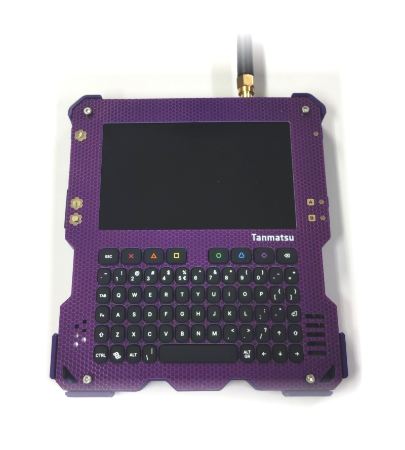

# Introduction

Tanmatsu is the dream terminal device for hackers, makers, and tech enthousiasts. Based around the powerful ESP32-P4 microcontroller, this device provides an accessible way to make, hack, and tinker on the go.

Tanmatsu lets you program on the go and communicate over long distances using LoRa whilst also providing advanced connectivity and extendability options for hardware hacking and development.



## Project

We have published an issue tracker on Github, where you can follow our project progress.

You can find out what we are currently working on in the [Github project](https://github.com/orgs/Nicolai-Electronics/projects/2/views/2).

If you have a suggestion or bug report you can create an issue on the [issue tracker](https://github.com/Nicolai-Electronics/tanmatsu-issue-tracker/issues).

And if you have questions or just want to ask something, feel free to ask anything you want over at our [Discord community](https://discord.gg/KkY6JqNCqT).

## When will my pre-order ship? [Last update 10-10-2025]

We're currently waiting for the manufacturer to ship the assembled mainboards to us. We expect those to arrive next week, if we're unlucky the week after.
After the mainboards arrive we will assemble the devices in batches, all the other parts needed for that (case, speaker, battery, display, keyboard & antenna) are all in stock and ready.

We will start shipping to all non-USA addresses immediately after, starting with the earliest order.

After all non-USA pre-orders have shipped we will start shipping the orders going to the USA.

This section of the documentation website will be updated often so be sure to check for updates now and then.

### USA specific information

#### Why are orders to USA addresses delayed?

US customs has introduced a non-standard way of tariff handling. Instead of the normal procedure that the rest of the world uses where a bill is sent by the receiver of a parcel when importing goods US customs has implemented a very convoluted system of charging the sender of a parcel after the parcel has shipped.

We are currently working on getting the contracts in place that allow us to ship to the USA again.

After those contracts are in place will verify that our calculations for the tariffs are correct before shipping any other parcel to the USA.

Once the exact tariff amount is clear we will put a surcharge on all USA orders that has to be paid in full before we ship the parcel.

It appears that US customs unfortunately does not just ask for the tariff percentage of 15% but also charges a significant handling fee.

#### How much will the USA tariff costs be?

The shipping company (PostNL) sent over a [link to an online calculator tool](https://tariffs.flexport.com/?entryDate=2025-09-15&country=NL&advanced=true&kotlinCalculator=true&useApi=true&modeOfTransport=AIR&htsCode=8471900000&value=117&FIELD_CHOSEN_HTS_CODES={"99039406"%3Afalse}&FIELD_CHOSEN_SPIS={}) to get an estimation of the amount US customs charges.

What this (as of writing) shows is an estimation of $18 (€ 15,33) for the 15% duty rate, but also a processing fee charged by US customs on top of the tariff of $33 (€ 28,11). In addition PostNL charges a fee for submitting the customs declaration. For that they want €0,45 + 2% of the duty paid to US customs. 2% of € 43,44 is € 0.87

Our expectation is thus that the total amount of tariff and import duties to be paid will thus be:

15,33 + 43,44 + 0,45 + 0,87 = € 60,09

Or converted back into USD: $ 70,56

We are looking into utilizing a distribution center in the USA to allow spreading the processing fee across multiple orders.

### Price increase after pre-order period ends

If you're still in doubt, grab your chance now as we will (unfortunately have to) increase the price of Tanmatsu slightly after the pre-order period ends.

## Features

Tanmatsu is based around the upcoming ESP32-P4 SoC by Espressif: their most powerful RISC-V microcontroller yet. With its 400MHz dual-core processor and 32MB of built-in PSRAM it makes the ideal platform for powerful processing on the go whilst still maintaining the ease of use one expects form a microcontroller platform.

In addition to the powerhouse ESP32-P4 application processor we have included an ESP32-C6 WiFi, Bluetooth Low Energy, and IEEE802.15.4 wireless radio module. This module enables wireless internet access, as well as access to local mesh networking like Thread and ZigBee in a hacker friendly way.

A LoRa radio module provides access to LoRa networks such as long distance mesh network services and (G)FSK modulated classic 433 or 868MHz communication, depending on the LoRa module installed.

The device has 16MB of built-in flash storage for firmware and applications, expandable using a micro SD card. The micro SD card socket supports SD cards at 3.3v and 1.8v voltage levels (SDIO 3) for extra fast transfer speeds.

A big MIPI DSI display and the QWERTY keyboard make for great ease of use both in the workshop and on the go.

In addition to all the built-in functionality the device allows for expansion modules using its two expansion ports. The back facing expansion port allows for expanding functionality using personality modules, while the side facing expansion port allows for easily connecting a wide variety of PMOD and SAO compatible accessories.

A QWIIC style expansion connector allows connecting the device to a wide range of sensors available from manufacturers such as Sparkfun and Adafruit, it supports both the I2C and the new I3C communication bus standards.

A 3D printed case is included with every Tanmatsu, this sturdy case will allow the device to be used everywhere whilst keeping the electronics safe and protected.

## Software

The launcher firmware allows starting user made applications and in addition it provides access to a marketplace for applications where developers can publish their creations. Apps can be downloaded and installed directly on the device.

## Summary of hardware features

 - ESP32-P4 dual-core 400MHz RISC-V microcontroller with 32MB of built-in PSRAM
 - ESP32-C6 radio module for WiFi, BLE and IEEE 802.15.4 mesh networking connectivity
 - Ai-Thinker Ra-01S or Ra-01SH module for long range communication using LoRa modulation and generic (G)FSK modulation for short range classic wireless radio applications at 433MHz or 868MHz respectively
 - 16MB of built-in flash storage for firmware and applications
 - Fast and big 800x480 MIPI DSI display
 - QWERTY keyboard
 - Lithium polymer battery
 - Audio output via headphone jack and speaker
 - I2C and I3C connectivity via Qwiic compatible JST SH style connector
 - SD card socket supporting SD cards at 3.3v and 1.8v voltage levels (SDIO 3)
 - Side facing expansion port with both SAO and PMOD capabilities
 - Back facing expansion port for expanding functionality using personality modules

## Summary of software features

 - Launcher menu for easy access to multiple applications and firmwares
 - Access to user generated content and applications repository via the hub app

## Open source

The hardware design has been made fully open source and available under a permissive license (CERN-OHL-P). The design can be edited using the open source PCB CAD application KiCAD, allowing everyone to edit the design without any roadblocks.

The board support package and launcher firmware are also open source under a permissive license (MIT), enabling modifications and improvements by the community and granting users and developers complete freedom and control.

You can find the hardware design [here](https://github.com/Nicolai-Electronics/tanmatsu-hardware), the board support package [here](https://github.com/badgeteam/esp32-component-badge-bsp) and the launcher firmware [here](https://github.com/Nicolai-Electronics/tanmatsu-launcher/).

## Personality modules

Whilst the base Tanmatsu device already provides lots of functionality we plan on creating and making available multiple personality modules for extending the functioality in ways useful to you.
More information about the planned personality modules will be made available soon.

```{toctree}
:hidden:

self
user_manual/index
hardware/index
software/index
add-on/index
```
