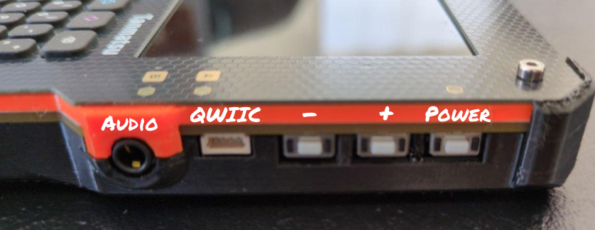

# User manual

```{toctree}
:hidden:
self
```

## Introduction

Congratulations! You just got your hands on your Tanmatsu, we bet you're excited to get started so let's not delay and get right to it!

## Connectors and buttons

There are a lot of connectors and buttons on Tanmatsu, let's start with the basics: how do you turn the device on and off?

### Right side

On the right side of the device you will find three buttons and a couple of connectors.



From the top the first button is the power button. Pressing this button for `2.5 seconds` will power on the device. If you want to turn off the device simply hold it for `half a second`.

The `+` and `-` buttons normally have software defined functions, for example changing audio volume. Since the function depends on the software the function of these buttons will differ between applications. In the launcher the buttons are currently unused.

The `-` button also allows for device recovery in case the installed firmware somehow makes it impossible to connect to the device via USB. Simply press the `-` button while powering on the device to force the ESP32-P4 application processor into `bootloader` mode. In this mode you can flash firmware using `esptool.py` or using the [web recovery](https://recovery.tanmatsu.cloud) application.

The `QWIIC` connector allows for connecting accessories. [QWIIC](https://www.sparkfun.com/qwiic), otherwise called [STEMMA QT](https://learn.adafruit.com/introducing-adafruit-stemma-qt/what-is-stemma) is a standard developed by Sparkfun and Adafruit that makes use of a JST style SH 1.0mm pitch connector to connect accessories via `I2C` communication. The port on Tanmatsu makes use of two separate GPIO pins, allowing you to use the two data lines for any application. The `ESP32-P4` application processor can expose multiple periperals on these pins, for example `I2C` (controller and peripheral), `I3C` (controller only) and `UART`.

The `audio` connector allows for connecting headphones. The audio codec on Tanmatsu allows setting the audio volume level separately from the digital audio data stream coming from the application processor.

### Left side

tbd

### Top side

tbd

## Charging your Tanmatsu

You can charge your Tanmatsu by plugging in a power source (phone charger or computer) into the USB-C port. Tanmatsu will automatically power on when a power source is detected and battery charging will start automatically.

Tanmatsu will only charge when on or in sleep mode. *If Tanmatsu is powered off the battery will not be charged even with a power source connected to the USB-C port.* The default firmware for Tanmatsu will include a mode which turns off the radio and display and keyboard backlight before putting the ESP32-P4 application processor into deep sleep mode. You can enter this mode by pressing the power button for less than half a second. You can check if your Tanmatsu is charging by looking at the color of the power LED.

## The power LED

Tanmatsu has multiple LEDs on its frontpanel. The LED at the top-left corner serves as power LED. The color of this the power LED usually indicates the state of the power management system.

The power LED is `GREEN` when the device is running on battery, `YELLOW` when charging, `MAGENTA` when the battery has not been detected and blinking `RED` if a fault has occured. When a fault occurs charging is automatically stopped.

## PMIC status LED

There is a small red LED on the back of the mainboard. This LED provides additional status information about the state of the power management system of Tanmatsu.

 - Off: the battery is not being charged
 - Slow blinking: a PMIC fault has occured
 - Rapid bliniing: Tanmatsu is trying to charge the battery but no battery is being detected
 
PMIC stands for "Power Management Integrated Circuit". Tanmatsu uses a BQ25895 PMIC from Texas Instruments to manage battery charging.

## Power fault conditions

A fault doesn't immediately mean there is anything wrong with your Tanmatsu and using a Lithium Polymer battery is not dangerous if the battery is handled correctly. Tanmatsu contains a multiple layers of protection to prevent any damage to your device, the battery or it's surroundings. If charging is stopped due to a fault then most likely there is something wrong with your battery, though this doesn't immediately have to be a problem.

The protection functions built into the Tanmatsu mainboard will, in addition to the battery protection circuit built into the battery itself, stop charging if it detects that the battery voltage is below the minimum safe threshold for a Lithium Polymer battery or above the maximum voltage threshold of a Lithium Polymer battery. In both cases the power LED will rapidly blink in red and the small red LED on the back of the mainboard will 

A situation that can trigger the under-voltage protection is a situation where the battery has drained below it's rated minimum voltage due to degradation when left completely empty for a long period of time. In this situation is is also possible that the battery simply is not detected, in which case the power LED will turn red when an external power source is connected. If the battery has accidently reached a voltage near 2.5 volt then the battery will be disconnected to protect it. Normally the battery voltage recovers a bit automatically after leaving the battery alone for a few minutes. In this situation you can safely restart start charging the battery again after the voltage has reached it's normal level.

The battery supplied with your Tanmatsu has a built-in protection circuit preventing the battery from draining below it's minimum rated voltage during normal use.

A Lithium Polymer battery that has reached a voltage below 2.5 volt for a prolonged period of time can become chemically unstable, we recommend replacing the battery if your battery has drained below 2.5 volt. Recharging a Lithium Polymer battery that has been subjected to a situation where it reached a voltage of less than 2.5 volt can be dangerous, the battery may for example swell up and could potentially damage the device or it's surroundings.

#### Debug connection

To connect to the USB debug, use the monitor function from ESP-IDF. Remember to have the USB function in debug mode.

The flow is as following:
* Set the USB in USB mode
* Compile the app
* Upload the app using bagdelink
* Set the USB to debug mode (such that the small bug is visible)
* Run the following command in your app folder to monitor the app:

```bash
PORT=/dev/cu.usbmodem1301 make monitor
```

Change PORT to match what device name your Tanmatsu gets when you connect it to your computer. cu.usbmodem1301 is for Mac OS.

The monitor function automatically decodes stacktraces and other addresses, making it easier to understand a crash when it happens.

To exit the monitor press Ctrl-]. For more information check out the [ESP-IDF documentation](https://docs.espressif.com/projects/esp-idf/en/stable/esp32/api-guides/tools/idf-monitor.html#idf-monitor).
